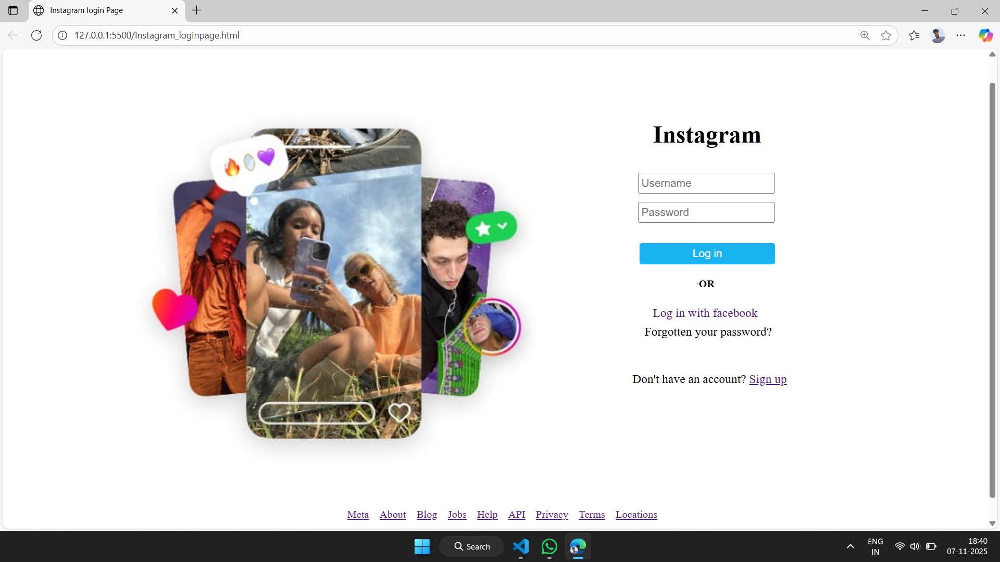

# 📸 Instagram Login Page Clone  

This is my *first web development project* — an Instagram Login Page clone built using *HTML and CSS*.  

## 🧠 What I Learned  
- Structuring a webpage using HTML  
- Styling elements with CSS  
- Positioning and aligning layout items  
- Adding images and buttons like a real login page  

---

## 🛠 Technologies Used  
- HTML  
- CSS  
- Visual Studio Code  

---

## 📷 Project Screenshot  

(Replace the above file name with your actual screenshot image name and make sure it’s in the same folder.)

---

## 🚀 About This Project  
This project helped me understand the basics of front-end web development.  
I tried to recreate the Instagram login page design as closely as possible to practice layout and styling skills.  

---

## 💡 Future Improvements  
- Make it responsive for mobile view 📱  
- Add functionality using JavaScript ⚙  

---

👨‍💻 *Created by:* [Your Name]  
📅 First Project — HTML & CSS Journey Begins!

